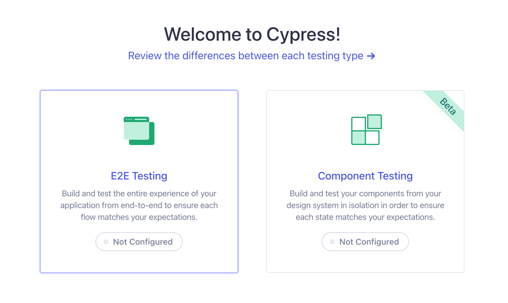
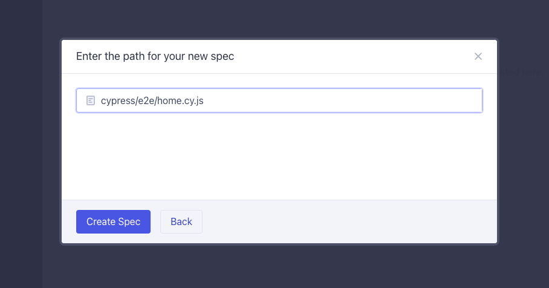
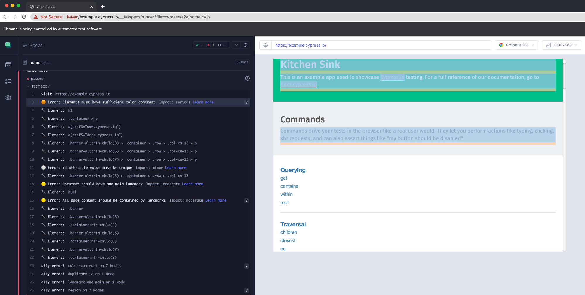

# A11Y Analyser

[](https://www.npmjs.com/package/a11y-analyser)

Test accessibility with in [Cypress](https://cypress.io).

## Installation

1. **Install `a11y-analyser` from npm:**

```sh
npm install --save-dev a11y-analyser
```

2. **Install peer dependencies:**

```sh
npm install --save-dev cypress axe-core cypress-axe cypress-terminal-report
```
3. **Configure Cypress.**

- Run the command below:

```js
npx cypress open
```

Then cypress will opens a window dialogue like this one:
  
Selecting E2E Testing it will create a configuration environment for us.
  
Just hit the continue button and select a browser to start testing.
Afterwards you can create your first spec with Cypress in this interface or you can create your specs mannualy inside the folder `cypress/e2e`.
  
  
After hit create and run your test inside the interface of tests of the Cypress.


4. **Include the commands.**

- Update `cypress/support/e2e.js` file to include the cypress-axe commands by adding:

```js
import 'a11y-analyser'
```

5. **Include the configuration.**

- Update `cypress.config.js` file to include the a11y-analyser commands by adding:

```js
const { defineConfig } = require("cypress");

module.exports = defineConfig({
  env: {
    "hideElements": true              // To hide elements like XHR requests
  },
  e2e: {
    baseUrl: 'http://localhost:8080', // Choose you localhost
    screenshotOnRunFailure: false,    // Don't take screenshots
    video: false,                     // Don't record videos
    setupNodeEvents(on, config) {
      require('cypress-terminal-report/src/installLogsPrinter')(on);
    },
  },
});
```

> NOTE: To use require import, make sure there ins't a `"type": "module",` inside your `package.json` and if using typescript and es6 imports ensure `esModuleInterop` is enabled.


## Commands

### cy.analyseA11y

This will inject the `axe-core` runtime into the page under test.


```js
it('Test', () => {
  cy.analyseA11y('http://localhost:8080')
})
```


### Examples

#### Basic usage

```js
describe('Example tests', () => {  
  it('Should log any accessibility failures', () => {
    cy.analyseA11y('https://example.cypress.io');
  })

  it('Should execute ONLY specific elements on the page', () => {
    cy.analyseA11y('https://example.cypress.io', '.container', null);
  })
  
  it('Should exclude specific elements on the page', () => {
    cy.analyseA11y('https://example.cypress.io', { exclude: ['.banner'] }, null);
  })

  it('Should ONLY include rules with serious and critical impacts', () => {
    cy.analyseA11y('https://example.cypress.io', null, { includedImpacts: ['critical', 'serious'] });
  })

  it('Should exclude specific accessibility rules', () => {
    cy.analyseA11y('https://example.cypress.io', null, {
      rules: {
        'color-contrast': { enabled: false }
      }
    });
  })

  it('Should ONLY include rules with these levels of conformance', () => {
    cy.analyseA11y('https://example.cypress.io', null, {
      runOnly: {
          type: 'tag',
          values: ['wcag2a', 'wcag2aa']
        }
      }
    );
  })
})
```

## Standard Output

When accessibility violations are detected, your test will fail and an entry titled "A11Y ERROR!" will be added to the command log for each type of violation found (they will be above the failed assertion). Clicking on those will can see where they are on screen and more like impact and a link to a documentation from Axe-core.



A similar output is present on terminal.


## Authors

The project was created by [Guilherme Almeida](https://guisalmeida.com/).

## Contributors

This project follows the [all-contributors](https://github.com/all-contributors/all-contributors) specification. Contributions of any kind welcome!

## License

MIT License, see the included [License.md](License.md) file.
